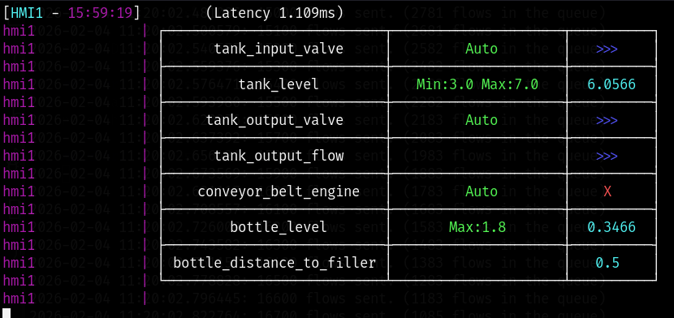
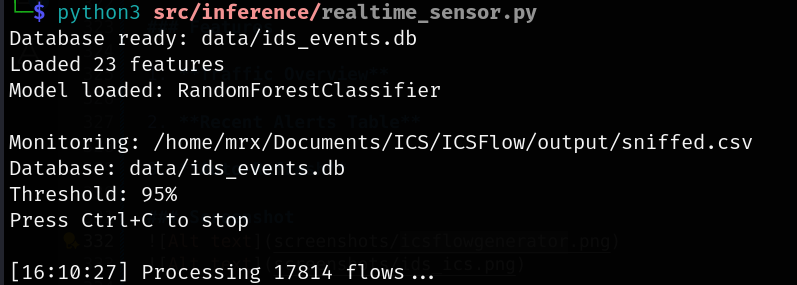
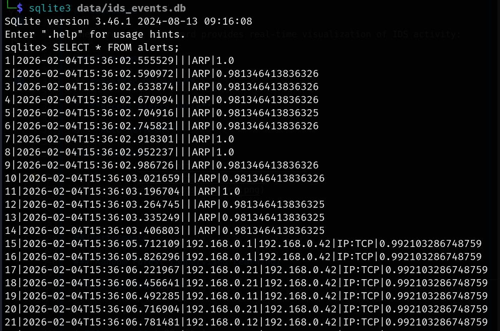
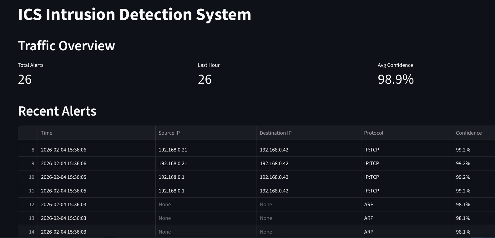

# 🛡️ AI-Based Intrusion Detection System for Industrial Control Systems (ICS)

[](https://www.python.org/)
[](LICENSE)
[]()
[](https://arxiv.org/abs/2305.09678)

A real-time AI-based intrusion detection system designed specifically for Industrial Control Systems (ICS). This project implements a scientifically-grounded methodology based on the **ICS-Flow research framework**, faithfully following peer-reviewed approaches and extending them toward a real-time, deployable IDS prototype with online inference and monitoring capabilities.

---

##  Project Philosophy

Rather than designing an IDS in an ad-hoc manner, this project:
-  **Follows scientific methodology** from peer-reviewed research
-  **Uses official ICS-Flow dataset** (Kaggle-published benchmark)
-  **Employs paper-specified tools** (ICSSIM testbed, ICSFlowGenerator)
-  **Extends offline experiments** to real-time deployment
-  **Acknowledges limitations** (dataset/domain shift, environment dependency)

This ensures methodological rigor, reproducibility, and meaningful comparison with published results.

---

## Table of Contents

- [Scientific Foundation](#scientific-foundation)
- [Architecture](#architecture)
- [Installation](#installation)
- [Quick Start](#quick-start)
- [Project Structure](#project-structure)
- [Real-Time Deployment](#real-time-deployment)
- [Dashboard](#dashboard)
- [Performance](#performance)
- [Research Perspective](#research-perspective)
- [Configuration](#configuration)
- [To-Do](#to-do)
- [References](#references)
- [Author](#author)

---

## Scientific Foundation

### 1.1 Reference Paper

This project is primarily based on the following scientific work:

**Alireza Dehlaghi-Ghadim, Mahshid Helali Moghadam, Ali Balador, Hans Hansson**  
*"Anomaly Detection Dataset for Industrial Control Systems"*  
arXiv:2305.09678, 2023  
 [Read Paper](https://arxiv.org/abs/2305.09678)

The paper introduces the **ICS-Flow dataset**, a realistic benchmark for evaluating machine-learning-based intrusion detection systems in ICS environments, and proposes a complete methodology covering:
- ICS testbed design
- Attack implementation
- Flow-based feature extraction
- Labeling strategies
- Supervised and unsupervised ML evaluation

### 1.2 ICS-Flow Dataset

The IDS is trained and evaluated using the **publicly available ICS-Flow dataset**, released by the paper's authors.

**Dataset Properties:**
- Generated from a realistic ICS simulation (bottle-filling factory)
- Built using the ICSSIM framework
- Contains:
  - Raw PCAP files
  - Flow-level network features
  - Process state variables
  - Attack logs

**Attack Scenarios Included:**
-  **Reconnaissance**: IP scan, Port scan
-  **Replay attacks**
-  **Distributed Denial of Service (DDoS)**
-  **Man-in-the-Middle (MITM)**: False data injection

**Dataset Access:**  
 [Kaggle: ICS-Flow Dataset](https://www.kaggle.com/datasets/alirezadehlaghi/icssim)

> **Note**: This project does not modify the dataset semantics and uses it as intended by the authors.

### 1.3 Feature Selection Strategy (Paper-Driven)

The reference paper applies **mRMR (Minimum Redundancy Maximum Relevance)** feature selection to reduce dimensionality and retain the most informative network flow features.

**Following the paper exactly:**
-  **23 flow-level features** are selected
-  Only features with **mRMR score ≥ 0.07** are retained
-  No additional features introduced

This ensures methodological consistency and enables meaningful comparison with the paper's results.

### 1.4 Labeling Strategy

The paper proposes two labeling strategies:
1. **Injection Timing (IT)**
2. **Network Security Tools (NST)**

For intrusion detection, the task is formulated as **binary classification**:
- `0` → Normal flow
- `1` → Attack flow

**This project:**
- Uses the **NST binary label (NST_B_Label)**

---

## Architecture

```
┌─────────────────────────────────────────────────────────────┐
│                ICSSIM Dockerized ICS Testbed                 │
│          (PLCs, HMIs, Sensors, Actuators, Modbus/TCP)       │
└──────────────────────┬──────────────────────────────────────┘
                       │ Network Traffic
                       ▼
┌─────────────────────────────────────────────────────────────┐
│           ICSFlowGenerator (Flow Extraction Tool)            │
│  • Sniffs packets from docker bridge (br_icsnet)            │
│  • Converts raw packets → flow-level features                │
│  • Outputs: CSV with 23 mRMR-selected features              │
└──────────────────────┬──────────────────────────────────────┘
                       │ sniffed.csv
                       ▼
┌─────────────────────────────────────────────────────────────┐
│            Real-Time Sensor (realtime_sensor.py)             │
│  • Polls CSV every 2 seconds                                 │
│  • Preprocesses: normalize + encode protocol                 │
│  • Runs ML inference (Random Forest / Isolation Forest)      │
│  • Stores high-confidence attacks (≥95%) in SQLite           │
└──────────────────────┬──────────────────────────────────────┘
                       │ 
                       ▼
┌─────────────────────────────────────────────────────────────┐
│              SQLite Database (ids_events.db)                 │
│  Table: alerts                                               │
│  Schema: timestamp, src_ip, dst_ip, protocol, confidence    │
└──────────────────────┬──────────────────────────────────────┘
                       │
                       ▼
┌─────────────────────────────────────────────────────────────┐
│                 Streamlit Dashboard (app.py)                 │
│  • Traffic overview metrics                                  │
│  • Real-time alerts table                                    │
│  • Auto-refresh (5 seconds)                                  │
└─────────────────────────────────────────────────────────────┘
```

**Key Design Principle**: The IDS uses the same flow extraction tool (ICSFlowGenerator) for both:
- **Offline training** (on ICS-Flow dataset)
- **Online deployment** (on live ICSSIM traffic)

This ensures **feature compatibility** between training and deployment environments.

---

## Installation
### Clone Repository

```bash
git clone https://github.com/morchidy/AI-Based-IDS-for-ICS.git
cd AI-Based-IDS-for-ICS
```

### Install Dependencies

```bash
pip install -r requirements.txt
```
---

## Quick Start

### 1. Prepare Dataset

Place your ICS-Flow dataset in `data/raw/Dataset.csv`

### 2. Run Preprocessing

```bash
python src/preprocessing/preprocess_dataset.py
```

This will:
- Extract 23 mRMR-selected features
- Split data (50% train, 20% val, 30% test)
- Normalize features using MinMaxScaler
- Save artifacts to `models/artifacts/`

### 3. Train Models

**Random Forest (Supervised):**
```bash
python src/training/train_rf.py
```

**Isolation Forest (Unsupervised):**
```bash
python src/training/train_if.py
```

### 4. Start Real-Time Sensor

```bash
python src/inference/realtime_sensor.py
```

The sensor will:
- Monitor network flow CSV file
- Detect attacks in real-time
- Store alerts in SQLite database

### 5. Launch Dashboard

```bash
streamlit run dashboard/app.py
```

Access the dashboard at: **http://localhost:8501**

---

## Project Structure

```
AI-Based-IDS-for-ICS/
│
├── data/
│   ├── raw/                    # Original datasets
│   │   └── Dataset.csv
│   ├── processed/              # Train/val/test splits
│   │   ├── X_train.csv
│   │   ├── X_val.csv
│   │   ├── X_test.csv
│   │   └── y_*.csv
│   └── ids_events.db           # SQLite database (alerts)
│
├── models/
│   ├── artifacts/              # Preprocessing objects
│   │   ├── minmax_scaler.pkl
│   │   ├── protocol_encoder.pkl
│   │   └── selected_features.json
│   ├── supervised/
│   │   └── rf_model.pkl        # Random Forest model
│   └── unsupervised/
│       └── if_model.pkl        # Isolation Forest model
│
├── src/
│   ├── preprocessing/
│   │   └── preprocess_dataset.py    # Feature engineering
│   ├── training/
│   │   ├── train_rf.py              # Random Forest training
│   │   └── train_if.py              # Isolation Forest training
│   └── inference/
│       └── realtime_sensor.py       # Live monitoring
│
├── dashboard/
│   └── app.py                       # Streamlit dashboard
│
├── README.md
├── requirements.txt
└── .gitignore
```

---
## Real-Time Deployment

### From Dataset to Deployment

While the reference paper focuses on **offline evaluation**, this project extends the methodology to **real-time intrusion detection** by integrating with the same testbed used to generate the dataset.

### ICSSIM Testbed

**What is ICSSIM?**  
ICSSIM is a framework for building ICS security testbeds, introduced by the same authors in:


> *"ICSSIM — A Framework for Building Industrial Control Systems Security Testbeds"*

**Architecture:**
-  Dockerized ICS simulation
-  Simulates bottle-filling factory
-  PLCs, HMIs, sensors, actuators
-  Modbus/TCP communication protocol
-  Reproducible attack execution

**Why ICSSIM?**  
Testing the IDS on the same platform that generated the training dataset ensures:
-  Feature compatibility
-  Realistic attack scenarios
-  Reproducible evaluation
-  Minimal dataset/domain shift

### ICSFlowGenerator Integration

**Offline (Training):**
```bash
# Convert PCAPs → Flow CSV for model training
ICSFlowGenerator --input dataset.pcap --output flows.csv
```

**Online (Deployment):**
```bash
# Sniff live traffic from docker bridge and generate flows
ICSFlowGenerator --interface br_icsnet --output sniffed.csv --live
```

**Key Benefit:**  
Using the same flow extraction tool for both training and deployment guarantees that:
- Feature semantics match exactly
- Preprocessing is consistent
- Models generalize correctly


## Dashboard

The Streamlit dashboard provides real-time visualization of IDS activity:

### Features

1. **Traffic Overview**

2. **Recent Alerts Table**

3. **Auto-Refresh**

### Screenshot





---

## Performance

### Random Forest (Supervised Learning)

**Test Set Results:**

| Metric | Value |
|--------|-------|
| **Accuracy** | 99.53% |
| **Precision** | 98.28% |
| **Recall** | 99.37% |
| **F1-Score** | 98.82% |

**Confusion Matrix:**

|              | Predicted Normal | Predicted Attack |
|--------------|------------------|------------------|
| **Actual Normal** | TN: 10,965 | FP: 47 |
| **Actual Attack** | FN: 17 | TP: 2,687 |


---

### Isolation Forest (Unsupervised Learning)

**Test Set Results:**

| Metric | Value |
|--------|-------|
| **Accuracy** | 88.33% |
| **Precision** | 90.23% |
| **Recall** | 45.78% |
| **F1-Score** | 60.75% |

**Confusion Matrix:**

|              | Predicted Normal | Predicted Attack |
|--------------|------------------|------------------|
| **Actual Normal** | TN: 10,878 | FP: 134 |
| **Actual Attack** | FN: 1,466 | TP: 1,238 |

---

## Research Perspective

### Domain Shift and Limitations

Consistent with the paper's discussion, this project explicitly acknowledges fundamental challenges in ICS intrusion detection:

**1. Environment Dependency**
- IDS performance varies across different ICS environments
- Models trained on one testbed may not generalize perfectly
- Network topology, protocols, and traffic patterns affect detection

**2. Dataset/Domain Shift**
- Training data (ICSSIM) vs. real-world ICS networks
- Attack diversity in training vs. deployment
- Temporal concept drift (evolving attack techniques)

---

## Configuration

### Confidence Threshold

Adjust in `src/inference/realtime_sensor.py`:

```python
monitor_realtime(
    confidence_threshold=0.95  # 95% confidence required for alert
)
```

### Dashboard Refresh Rate

Edit `dashboard/app.py`:

```python
time.sleep(5)  # Refresh every 5 seconds
st.rerun()
```

---

## To-Do
- [ ] Add ANN model training script
- [ ] Implement autoencoder for anomaly detection
- [ ] Add email/Slack alert notifications
- [ ] Create model comparison script
- [ ] Add comprehensive unit tests
- [ ] Implement logging system
- [ ] Add configuration file support
- [ ] Create Docker container
- [ ] Add CI/CD pipeline

---

## References

### Primary Reference

**Alireza Dehlaghi-Ghadim, Mahshid Helali Moghadam, Ali Balador, Hans Hansson**  
*"Anomaly Detection Dataset for Industrial Control Systems"*  
arXiv:2305.09678, 2023  
 [https://arxiv.org/abs/2305.09678](https://arxiv.org/abs/2305.09678)

### Related Work

**ICSSIM Framework:**  
*"ICSSIM — A Framework for Building Industrial Control Systems Security Testbeds"*  
By the same authors

### Dataset

**ICS-Flow Dataset:**  
 [Kaggle](https://www.kaggle.com/datasets/alirezadehlaghi/icssim)

### Tools

- **ICSFlowGenerator**: Official flow extraction tool (paper-provided)
- **ICSSIM**: Dockerized ICS testbed framework

---

## Author

**Morchid Youssef**
- GitHub: [@morchidy](https://github.com/morchidy)
- Project: [AI-Based-IDS-for-ICS](https://github.com/morchidy/AI-Based-IDS-for-ICS)
- Email: morchidy33@gmail.com